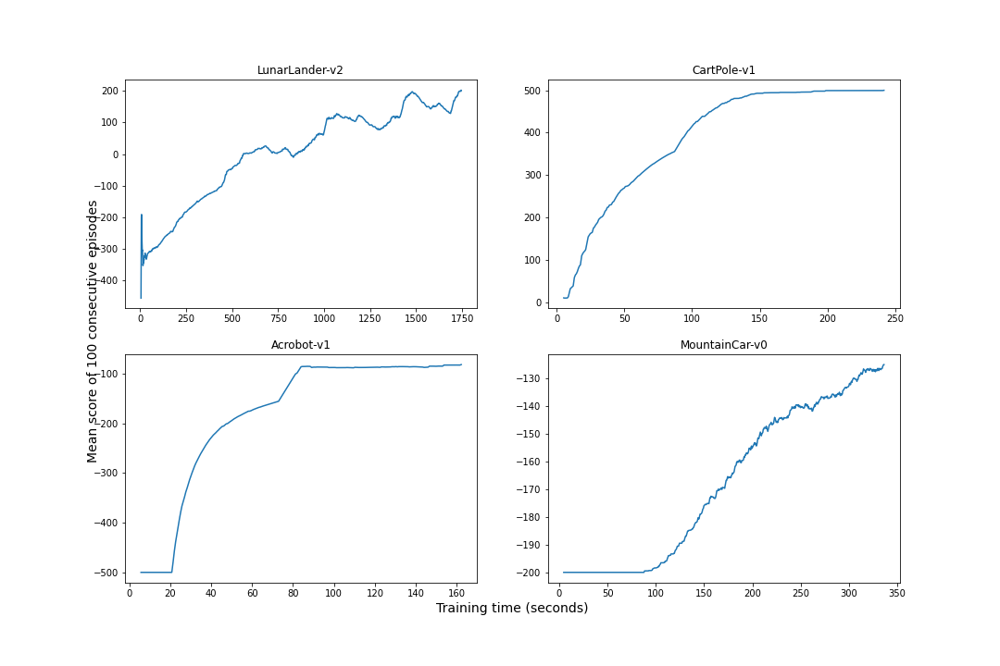

## Distributed Deep Reinforcement Learning framework (DDRL)


This distributed framework supports the [Proximal Policy Optimization](https://arxiv.org/abs/1707.06347) (PPO) algorithm along with off-policy correction methods like [V-trace](https://arxiv.org/abs/1802.01561) and [TD(λ)](https://en.wikipedia.org/wiki/Temporal_difference_learning#:~:text=TD%2DLambda%20is%20a%20learning,level%20of%20expert%20human%20players.). The experiences collected by multiple actors are sent to a single buffer and later on being sampled by the learner for minibatches updates. The actors sync its weights periodically with the learner.

Inter-process communication (IPC) between actors and the learner is implemented by socket programming, which provides a simple network interface for IPC between threads, processes and even different machines over the Internet.

## Installation and Run

### Install DDRL
Clone this repository, create a [Python virtual environment](https://docs.python.org/3/library/venv.html) and run `pip3 install -r requirements.txt`.

### Example of a training execution
In terminal 
```
TIME=15 NWORKERS=3 make run_lunar
```
This means that we will train an agent for the task `run_lunar` with 3 workers and the training process will shutdown automatically after 15 minutes. For more details, check [Makefile](Makefile).

## Plans

We aim to make this framework highly modular and flexible to any algorithms, environments and design choices. For example, we can add custom neural network architectures into the [networks](ddrl/networks) folder and quickly adapts to new set of hyperparamters by modifying or adding [config files](configs).

Because we are still developing this framework, feel free to make suggestions and report bugs.

Future plan:
- [ ] Add [UPGO](https://deepmind.com/blog/article/AlphaStar-Grandmaster-level-in-StarCraft-II-using-multi-agent-reinforcement-learning).
- [ ] A wrapper for custom environments aparts from OpenAI gym.
- [ ] A wrapper for custom choices of networks (like shared network for Actor-Critic, ConvNet-based networks, ...).

## Bechmarks

### OpenAI Gym  

